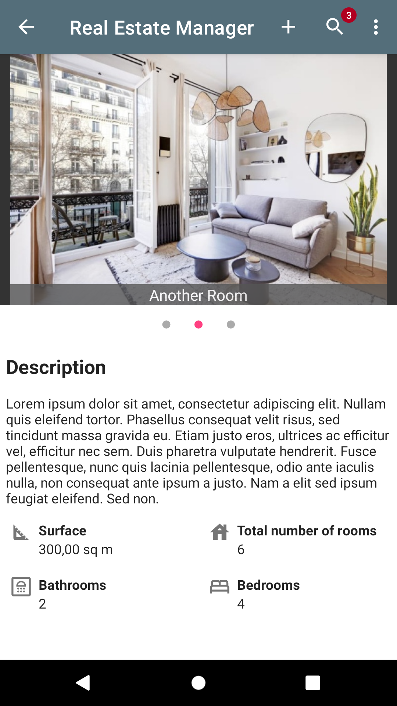

### Real Estate Manager

Cette application Android permet aux agents immobiliers de gérer leur portefeuille de biens. Ils peuvent lister, éditer, ajouter des biens, et compléter leur 
annonce avec des photos. Les modifications sont visibles en direct par les autres utilisateurs.

## Fonctionnalités

- Ajouter, modifier des biens
- Ajouter des photos en les prenant directement avec le téléphone ou la tablette, ou en les important depuis la galerie.
- Faire une recherche multi-critères
- Utilisation possible à 100% hors-ligne. Les images et les données sont stockées en local et à distance avec deux dépôts synchronisés.

## Aspects techniques

- Architecture MVVM
- Room + Firbase Firestore  
- Coroutines
- Google Maps API
- Navigation différenciée pour tablette et mobile, gérée avec Navigation Component

## Captures d'écran

## Dernière modification
05/03/2022

